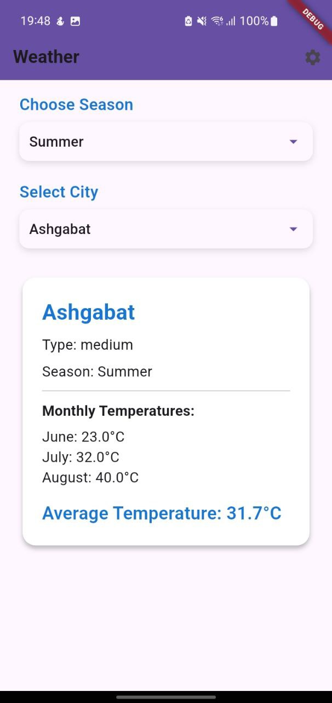
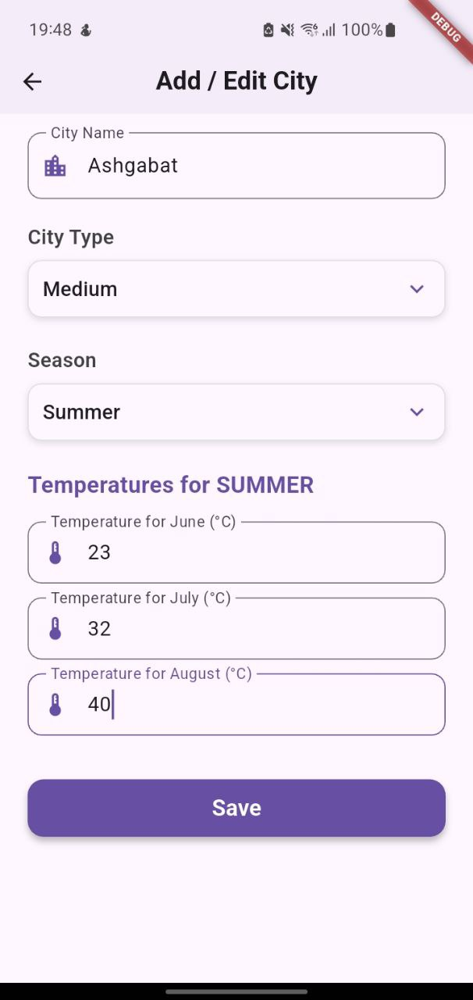

# weather_app

WeatherApp — Simple Weather Application (Flutter + BLoC)
📌 Overview

## 📷 Screenshots

  
  &nbsp;&nbsp;
  

WeatherApp is a simple Flutter application with two screens that demonstrates working with dynamic data, state management using BLoC, and persistent storage.

    Screen 1 — Display:
    Select a city and a season, see the average temperature for that season, and view the city type (small / medium / large).

    Screen 2 — Settings:
    Manage the city list (name & type) and set monthly temperatures for each city. The data entered here is used on Screen 1.

Example:
If in the settings you enter:
City = Minsk, Type = Medium, June = 23, July = 28, August = 25,
then for summer the app will show:
Average temperature = (23 + 28 + 25) / 3 = 25.3°C.
🎯 Features
Screen 1 — Display

    Select a city from a dropdown (data from Settings).

    Select a season: Winter, Spring, Summer, Autumn.

    Show:

        City name

        City type (small, medium, large)

        Average seasonal temperature (rounded to 1 decimal).

Screen 2 — Settings

    Add / Edit / Delete cities.

    Set the type of each city.

    Enter temperatures for each month (January–December).

    Save data locally so Screen 1 updates instantly.

📅 Seasons & Average Calculation
Season	Months
Winter	December, January, February
Spring	March, April, May
Summer	June, July, August
Autumn	September, October, November

Formula:

Average temperature = (month1 + month2 + month3) / 3

Example:
(23 + 28 + 25) / 3 = 25.3°C
🛠️ Technologies Used

    Flutter (latest stable)

    BLoC for state management

    Equatable for value comparisons

    Shared Preferences (or Hive) for local data persistence

📂 Project Structure (Recommended)

    lib/
    ├─ main.dart
    ├─ app.dart                   # App entry with routes & theme
    ├─ bloc/                      # All BLoC logic
    │  ├─ city_bloc/
    │  │  ├─ city_bloc.dart
    │  │  ├─ city_event.dart
    │  │  ├─ city_state.dart
    │  ├─ settings_bloc/
    │     ├─ settings_bloc.dart
    │     ├─ settings_event.dart
    │     ├─ settings_state.dart
    ├─ models/
    │  └─ city.dart
    ├─ repositories/
    │  └─ city_repository.dart
    ├─ services/
    │  └─ storage_service.dart
    ├─ screens/
    │  ├─ home_screen.dart
    │  └─ settings_screen.dart
    ├─ widgets/
    │  ├─ city_selector.dart
    │  ├─ season_selector.dart
    │  └─ month_temps_form.dart
    └─ utils/
       └─ seasons.dart

📦 Installation & Run
Requirements

    Flutter SDK ≥ 3.x

    Dart SDK ≥ 2.17

    Android Studio / VS Code / Xcode

Steps

    Clone the repository:

git clone <repo-url>
cd weather_app

Install dependencies:

flutter pub get

Run the app:

    flutter run

🧪 Testing

    Unit Tests:
    Test seasonal average calculation for edge cases (negative temperatures, decimals).

    Widget Tests:
    Check correct display of data after selecting city and season.

Example unit test:

final temps = [23.0, 28.0, 25.0];
expect(calculateSeasonAverage(temps), closeTo(25.3333, 0.0001));

🚀 Possible Improvements

    Import / Export city data as JSON

    Add a temperature chart

    Add localization (EN / RU)

    Sort cities alphabetically or by type

    Add user profiles
